<picture>
  <source media="(prefers-color-scheme: dark)" srcset="./dark.svg">
  <source media="(prefers-color-scheme: light)" srcset="./light.svg">
  
</picture>

## Hi, I'm Sushant

I take something messy, a system, a process, a feeling, and look for the shape underneath it.

By day I'm a Category Manager at Urban Company in Gurgaon. Off the clock I mentor students, watch films, and read more than I should.

## What I do

- **Screening systems:** building the checks that decide who gets onboarded and how well they're trained
- **Funnel RCA:** going day by day through a funnel until the real drop-off shows itself
- **Partner quality:** escalation systems and dashboards that surface problems early
- **Dashboards vs. ground truth:** making sure the numbers match what's actually happening on the field

## Experience

| Role | When | What it looked like |
| --- | --- | --- |
| **Category Manager (Central)**, Urban Company, Gurgaon | Jul 2025 to Present | Own Training and Partner Quality for 9 categories, 30+ trainers, and 250+ new provider approvals monthly across India |
| **Category Manager Intern, City Operations**, Urban Company, Delhi NCR | Jan 2025 to Jun 2025 | Managed 4 categories with a 350+ partner base |

<b>Full-time highlights</b>

- Built a dual-layer (L1/L2) screening system with 5 audit dashboards from scratch; trainer efficacy 40% to ~85%
- Ran day-level RCA on SPA batch funnels and restructured key stages, cutting two major drop-offs by 45% each
- Built HH adherence SOPs and a cancellation reversal system: adherence 73.56% (SPA) and 75.88% (MFM); reversal raise rate 8% to 15%
- Built an NPS/Activity Bot-driven escalation system and Partner Quality Dashboards (CAT x City): resolution TAT down 30%, provider satisfaction up 12%, good partner quantum up 10%
- Worked with the product team to reduce provider offline bookings ~27% (3.3% to 2.4%)

<b>Internship highlights</b>

- Ayurveda request loss ~22% to ~10%; Luxe request loss 17.65% to 12.16%
- Unlocked Luxe eligibility for 150 partners; onboarded 139 new Pros (64 Luxe, 75 Ayurveda)
- Built a churn-based onboarding model for proactive supply planning
- Designed and scaled UC MASTER, a pan-India referral program ensuring equitable provider compensation across beauty categories

## Leadership and community

- **President, 180 Degrees Consulting, BIT Mesra** (Apr 2024 to Apr 2025): directed a 100+ member chapter of one of the world's largest student-led consultancies, delivering consulting for startups, non-profits and social enterprises
  - 7 consulting projects (sustainability, food distribution) and 4 client acquisition initiatives, including Indigifts and Feeding India-Zomato
  - Mentored 2 college chapters on branch setup, governance and strategy
  - Scaled social reach 2x; engagement rate 30%+
- **National Finalist, Case Lane (180 Degrees Consulting):** outperformed 150+ teams across India
- **Certified:** Consulting Case Interviews & Guesstimates (Sankalp Chhabra)
- **Workshops** on LinkedIn Strategy, AI Automation and Notion Productivity for 150+ students
- **Mentoring** IIT-JEE aspirants and LinkedIn Launchpad students
- **NSS** (2-year tenure, Government of India): community outreach and social impact

## Featured projects

All three live in [Data-Analysis-Projects](https://github.com/jhasushant02/Data-Analysis-Projects).

- **Sales & Profit Analysis:** SQL + Tableau
- **Pizza Sales Dashboard:** a sales dashboard
- **Loan Defaulter EDA:** exploratory data analysis

## Stack and methods

**Tools:** SQL (Snowflake, MySQL), Tableau, Excel, Google Sheets, PowerPoint, Figma, Python / Jupyter

**Methods:** Supply-Demand Planning, Root Cause Analysis, Funnel Analysis, Stakeholder Management

I also build with no-code tools and automation.

## Currently exploring

**AI Automation.** What pulls me in is a simple question: which part of this process repeats, and can a system carry that weight? It's the same instinct behind the screening systems and dashboards I already build. I've run workshops on AI Automation (alongside LinkedIn Strategy and Notion Productivity) for 150+ students, but I'm still learning, not claiming expertise.

## Writing, and off the clock

I write at [my blog](https://sushant-jha.super.site/my-blogs).

Away from work, I watch films in their original language (dubbing kills the performance). I read business books to sharpen, fiction to soften, philosophy to stretch, and biographies to anchor.

## Education

**B.Tech, Chemical Engineering**, Birla Institute of Technology, Mesra (BIT Mesra), Ranchi, 2025

## Connect

- GitHub: [jhasushant02](https://github.com/jhasushant02)
- LinkedIn: [isushantjha](https://linkedin.com/in/isushantjha)
- Portfolio: [sushant-jha.super.site](https://sushant-jha.super.site/)
- Blog: [sushant-jha.super.site/my-blogs](https://sushant-jha.super.site/my-blogs)
- Email: [sushant.kr.jha02@gmail.com](mailto:sushant.kr.jha02@gmail.com)

---

*This isn't a portfolio. It's just what I'm building, on the clock and off it.*
